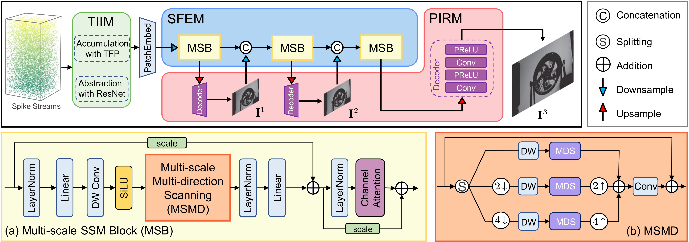
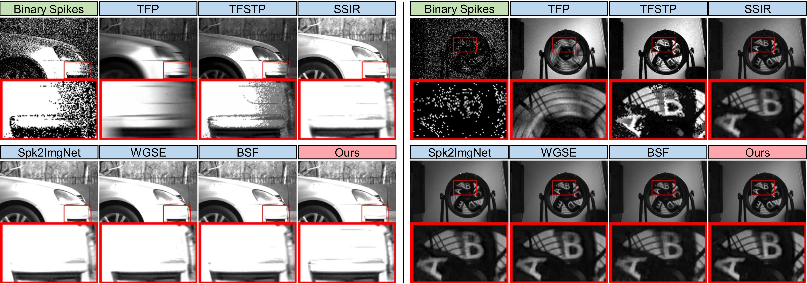

# Spk2ImgMamba: Spiking Camera Image Reconstruction with Multi-scale State Space Models

As a bio-inspired vision sensor, the spiking camera has showcased remarkable capability in high-speed imaging with a sampling rate of 40,000 Hz. Reconstructing clear images from continuous spike streams, which is obtained by each photosensor continuously detecting photons and firing them asynchronously, has garnered significant attention. Despite promising results, existing spike-to-image reconstruction methods face challenges in balancing global receptive fields and efficient computation due to the inherent limitations of their backbones. Recently, due to powerful long-range modeling and linear complexity, the state space model (SSM) has emerged as a competitive alternative to CNNs and Transformers. In this paper, we propose a lightweight spike-to-image reconstruction network that harnesses Mamba as the backbone. Our approach sequentially executes three core modules: temporal information integration, spatial feature enhancement, and progressive image reconstruction. The former accumulates cues across diverse temporal windows to explore both long-term and short-term contexts. Subsequently, to model global dependencies while heightening local detail perception, we develop a multi-scale SSM block characterized by multi-scale multi-direction scanning, which effectively boosts spatial feature representations. Finally, intensity images are decoded progressively from the enhanced light-intensity features. Extensive experiments on both synthetic and real-captured data demonstrate that our approach achieves state-of-the-art performance, with only 10% of the network parameters and nearly two orders of magnitude less computational effort.



 

## Installation

You can choose cudatoolkit version to match your server. The code is tested with PyTorch 2.1.1 with CUDA 11.8.

```shell
conda create -n spk2imgmamba python==3.9.0
conda activate spk2imgmamba
# You can choose the PyTorch version you like, for example
pip install torch==2.1.1 torchvision==0.16.1 torchaudio==2.1.1
```

Install the dependent packages:
```
pip install -r requirements.txt
```

Install core package
```
cd ./package_core
python setup.py install
```

In our implementation, we borrowed the code framework of [SSIR](https://github.com/ruizhao26/SSIR):

## Datasets

#### 1. SREDS dataset for training and evaluation: [SSIR](https://github.com/ruizhao26/SSIR).

#### 2. Real datasets for testing (including "momVidarReal2021", "PKU-Spike-High-Speed", "recVidarReal2019"): [Real_data](https://pan.quark.cn/s/1cf484a60865)

#### 3. Set the path of the SREDS dataset in your serve

Set that in `--data_root` when running train_Spk2ImgMamba.sh, eval_SREDS.sh or test_RealData.sh.

## Train
```
sh train_Spk2ImgMamba.sh
```

## Evaluate

```
sh eval_SREDS.sh
```

You can run following commands to obtain the qualitative evaluations on real data.

```
sh test_RealData.sh
```

## Statement

This project is for research purpose only, please contact us for the licence of commercial use. For any other questions or discussion please contact: yoonjasper0218@gmail.com